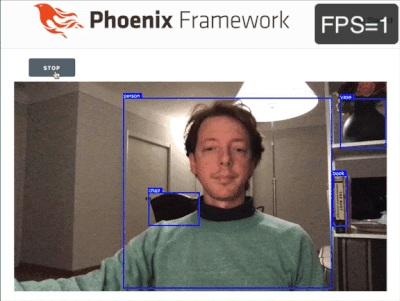

# Real-time Object Detection with Phoenix and Python



In this repository ([part1](https://github.com/poeticoding/yolo_example/tree/part1) tag) you find the code described in the [Real-time Object Detection with Phoenix and Python](https://www.poeticoding.com/real-time-object-detection-with-phoenix-and-python/) article.


## Python

This version uses [Elixir Port](https://hexdocs.pm/elixir/Port.html), which takes care of launching and communicating with [`python_scripts/detect.py`](python_scripts/detect.py). Be sure you have Python 3.6 installed, along with the libraries you find in [`python_scripts/requirements`](python_scripts/requirements.txt).

## Phoenix

Configure the `Yolo.Worker` in [`config/dev.exs`](config/dev.exs)

```elixir
config :yolo, Yolo.Worker,
  python: "python", # with Anaconda3 and yolo env is "/opt/anaconda3/envs/yolo/bin/python"
  detect_script: "python_scripts/detect.py",
  model: {:system, "YOLO_MODEL"}
```

* `:python` is the path of your python3.6 executable
* `:detect_script` is the path of the [`detect.py`](python_scripts/detect.py) script.
* just leave `:model` set to `{:system, "YOLO_MODEL"}` - it will load the model name from the `YOLO_MODEL` environment variable.

